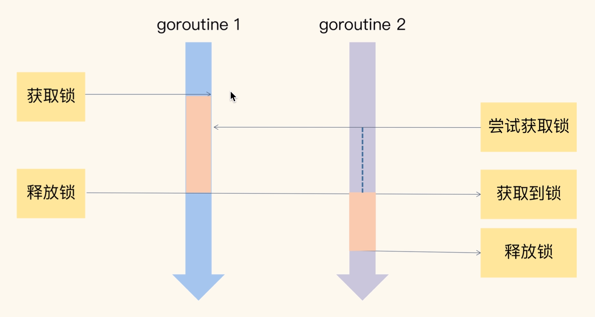

在 Go 的标准库中，package sync 提供了锁相关的一系列同步原语，这个package还定义了一个Locker的接口，Mutex就实现了这个接口。

## Mutex

Mutex 是go官方提供的互斥锁，它提供了两个方法 Lock 和 Unlock：进入临界区之前调用Lock方法，退出临界区的时候调用Unlock方法。我们可以使用互斥锁，限定临界区只能同时有一个线程持有。

  

当一个goroutine通过调用Lock方法获得了这个锁的拥有权后，其他请求锁的goroutine就会阻塞在Lock方法的调用上，直到锁被释放并且自己获取到了这个锁的拥有权。

**临界区**

在并发编程中，如果程序中的一部分会被并发访问或修改，那么，为了避免并发访问导致的意想不到的结果，这部分程序需要保护起来的程序，就叫做临界区

**例子**

```go
type Counter struct {
	CounterType int
	Name        string

	mu    sync.Mutex
	count uint64
}

func (c *Counter) Incr() {
	c.mu.Lock()
	c.count++
	c.mu.Unlock()
}
func (c *Counter) Count() uint64 {
	c.mu.Lock()
	defer c.mu.Unlock()
	return c.count
}

func mutex() {
	var counter Counter
	var wg sync.WaitGroup
	wg.Add(10)
	for i := 0; i < 10; i++ {
		go func() {
			defer wg.Done()
			for j := 0; j < 100000; j++ {
				counter.Incr()
			}
		}()
	}
	wg.Wait()
	fmt.Println(counter.Count())
}
```

### 互斥锁演进

- 初版：使用一个flag字段标记是否持有锁
- 给新人机会：新的goroutine也能有机会竞争锁
- 多给些机会：新来的和被唤醒的有更多的机会竞争锁
- 解决饥饿：解决竞争问题，不会让goroutine长久等待

**初版的互斥锁**

源码：
```go
func cas(val *int32, old, new int32) bool { return true }
func semacaquire(*int32)                  {}
func semralrease(*int32)                  {}

type Mutex struct {
	key  int32
	sema int32
}


func xadd(val *int32, delta int32) (new int32) {
	for {
		v := *val
		if cas(val, v, v+delta) {
			return v + delta
		}
	}
	panic("unreached")
}


func (m *Mutex) Lock() {
	if xadd(&m.key, 1) == 1 {
		return
	}
	semacaquire(&m.sema)
}


func (m *Mutex) Unlock() {
	if xadd(&m.key, -1) == 1 {
		return
	}
	semralrease(&m.sema)
}
```


> 注意：
> Unlock 方法可以被任意的 goroutine 调用释放锁，即使是没持有这个互斥锁的 goroutine，也可以进行这个操作。这是因为，Mutex 本身并没有包含持有这把锁的 goroutine 的信息，所以，Unlock 也不会对此进行检查。Mutex 的这个设计一直保持至今。
> **谁申请，谁释放**：在真实的实践中，我们使用互斥锁的时候， 很少在一个方法中单独申请锁，而在另外一个方法中单独释放锁，一般都会在同一个方法 中获取锁和释放锁。
> 例子如下:
> ```go
> type Foo struct {
> 	mu    sync.Mutex
> 	count int
> }
> 
> func (f *Foo) Bar() {
> 	f.mu.Lock()
> 	defer f.mu.Unlock()
> 
> 	if f.count < 1000 {
> 		f.count += 3
> 		return
> 	}
> 
> 	f.count++
> 	return
> }
> ```

缺点：
请求锁的 goroutine 会排队等待获取互斥锁。虽 然这貌似很公平，但是从性能上来看，却不是最优的。因为如果我们能够把锁交给正在占 用 CPU 时间片的 goroutine 的话，那就不需要做上下文的切换，在高并发的情况下，可 能会有更好的性能。

### Mutex常见的错误场景

**Lock/UnLock不是成对出现的**

三种情况：

1. 代码中有太多的if-else分支，可能在某个分支中漏写了Unlock
2. 在重构的时候把Unlock给删除了
3. Unlock误写成了Lock

**Copy已使用的Mutex**

Mutex是有自己的状态的，如果复制，也会将状态给复制下来

vet工具，可以检查出死锁，进而即使发现问题，即使修复。

```shell
go vet (pathfile)
```

**重入**

当一个线程获取锁时，如果没有其它线程拥有这个锁，那么，这个线程就成功获取到这个锁。之后，如歌其他线程在请求这个锁，就会处于阻塞等待的状态。但是，如果拥有这把锁的线程再请求这个锁，就会处于阻塞等待的状态。但是，如果拥有这把锁的线程再请求这把锁的话，不会阻塞，而是成功返回，所以叫可重入锁（有时候也叫做递归锁）。只要你拥有这把锁，你可以可着劲儿地调用，比如通过递归实现一些算法，调用者不会阻塞或者死锁。

可以通过Mutex来实现，通过两种方式：
1. goroutine id
2. token

**死锁**

两个或两个以上的进程（或线程，goroutine）在执行过程中，因争夺贡献资源而处于一种互相等待的状态，如果没有外部干涉，它们都将无法推进下去，此时，我们称系统处于死锁状态或系统产生了死锁

1. 互斥：至少一个资源是被排他性独享的，其他线程处于等待状态，直到资源被释放。
2. 持有和等待：goroutine持有一个资源，并且还在请求其他goroutine持有的资源，也就是咱们常说的“吃着碗里，看着锅里”的意思。
3. 不可剥夺：资源只能由持有它的goroutine来释放
4. 环路等待：一般来说，存在一组等待进程，P={P1，P2，...,PN},P1等待P2持有的资源，P2等待P3持有的资源，依次类推，最后是PN等待P1持有的资源，这就是形成来一个环路等待的死结。

