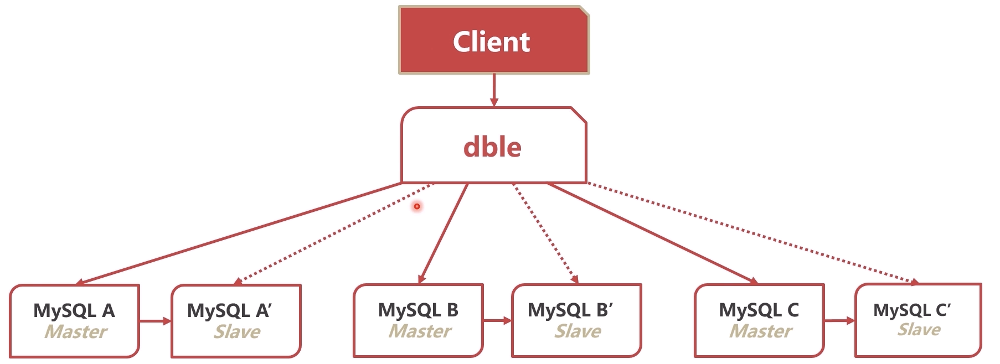

## 查询

### 事例数据库 Sakila-db

- Sakila 是MySQL中的示例数据库（sample database）
- Sakila展示了一个电影DVD租赁公司的后台管理系统
- 下载链接：
  - <https://downloads.mysql.com/docs/sakila-db.zip>
  - <https://downloads.mysql.com/docs/sakila-db.tar.gz>

### WHERE查询太慢，怎么办？ - 覆盖索引

**覆盖索引**：

- 覆盖索引指的是：查询语句从执行到返回结果均使用同一个索引
- 覆盖索引可以有效减少回表

**总结：**

- 覆盖索引通过取消回表操作，提升查询效率
- 若数据的查询不只使用了一个索引，则不是覆盖索引
- 可以通过优化SQL语句或优化联合索引，来使用覆盖索引

### MYSQL如何确定用哪一条索引

- MySQL在选取索引时，会参考索引的基数（Cardinality）
- 基数是MySQL估算的，反映这个字段有多少种取值
- 选取几个页算出取值的平均值，再乘以页数，即为基数

因为抽样的基数有很大可能不对，所以可以强制使用索引

**强制使用索引**:

- 使用 force index 可以强制使用索引

重新进行区分度估计，可以使用优化索引

**优化索引**:

- analyze table 可以重新统计索引信息
- 重新统计索引信息时，会重新计算索引的基数

**总结**：

- 更加索引基数，可以判断索引性能的好坏
- 使用force index可以强制使用索引
- analyze table 可以重新统计索引信息，修复基数信息

### COUNT怎么慢，怎么办？

**count()函数**

- 函数用来统计结果集中不为null的数据个数
- 首先存储引擎查询出结果集
- server层逐个结果判断是否为null，不为null则加1

**count(非索引字段)**

- count(非索引字段)时，server层需要判断每个数据是否为null
- 而且查询本身无法使用覆盖索引，理论上最慢

**count(索引字段)**

- count(索引字段)，可以覆盖，依然需要每次判断字段是否为null
- count(主键)，同理

**count(1)**

- Count(1)自由扫描索引数，没有索引数据航的过程，理论更快
- 但Server层依然每次需要判断 “1是否为null”

**count(*)**

- 一般用来返回数据表行树
- MyISAM的count(*)直接返回数据库中记录的数据表行数
- 由于InnoDB支持事务，数据库中不记录数据表行树
- MySQL专门优化了count(*)函数直接返回索引数中数据的个数

**总结**：

- count（非索引字段）：无法使用覆盖索引，最慢
- count（索引字段）：可以使用覆盖索引但依然要取出数据判空
- count（1）：不需要取出数据，但需要判断“1是否为null”
- count（*）：经过专门优化，不需要判空

### ORDER BY 步骤原理

`select * from film where fime_id > 80 order by title`

1. 根据 WHERE 等条件查询
2. 将查询结果放入sort_buffer（排序专用缓存）
3. 对中间结果集按照ORDER字段排序
4. 回表生成完整结果集（若需要）

**条件查询**：给查询字段加索引，可以改善条件查询速度

**中间结果集**：

- 中间表比较小时，直接放在内存中；
- 中间表大于 sort_buffer_size 时，放在硬盘中；
- 若需要优化内存占用，减小sort_buffer_size
- 若需要优化排序查询时间，增大sort_buffer_size

**回表生成完整结果集**

- 当行小于max_lenth_for_sort_data时，生成全字段中间表
- 大于阈值时，只生成排序字段+主键中间表，需要回表
- 调大阈值并不一定改善效率，因为太大的结果集排序效率低

**索引覆盖-最高效**

- 缩影覆盖可以跳过生成中间结果集，直接输出查询结果
- ORDER 字段需要有索引（或在联合索引左侧）
- 其他相关字段（条件、输出）均要在上述的索引中

**总结**

- MySQL排序一般需要生成中间结果集、排序、回表的过程
- 索引覆盖是最高效的处理排序的方式

### ORDER BY RAND() 原理

rand()函数随机生成[0,1)的小数

例子：`select title,description from film order by rand() limit 1`

1. 创建一个临时表，临时表的字段为rand、title、description
2. 从表中取出一行，调用RAND()，将结果和数据放入临时表，以此类推
3. 针对临时表，将rand字段+行位置（主键）放入sort_buffer
4. 对soft_buffer排序，取出第一个对行位置（主键），查询临时表

**为什么会慢？**

- SQL执行过程中出现了两次中间结果，都是全长度的
- 仅需要一个随机结果，缺经历了不必要的排序（虽然优化过）
- 调用了很多次RAND()

**解决方法-临时方案**

- 选取数据中最大的ID和最小的ID
- 使用RAND()随机选取一个ID
- 直接查询此ID的数据条目

```sql
select max(film_id),min(film_id) into @M,@N from film;
set @X = floor((@M-@N+1)*rand() + @N)
select title,description from fime where film_id >= @X limit 1;
```

**解决方法-业务方案**

- 查询数据表总数total
- total范围内，随机选取一个数字r
- 执行以下SQL：

```sql
select title,description from film limit r,1;
```

**总结**

- ORDER BY RAND() LIMIT 1 是效率很低的随机查询方式
- 原因主要是，上述方法有两次中间结果，还有排序过程
- 可以通过修改SQL，选取随机主键方式，提升性能
- 最好还是在业务中处理，尽量减少复杂SQL

### 带头大哥丢了，怎么办？

**索引下推**

- 为什么扫描行数非常少？
- MySQL5.6之前，需要先使用索引查询store_id in (1,2)再全部回表验证film_id=3
- MySQL5.6之后，如果索引中可以判断，直接使用索引过滤

**松散索引扫描**

- 带头大哥不能死，中间兄弟不能丢？为什么不管带头大哥了？
- MySQL8.0新特性

**总结**

- 联合缩影可以加速一些特殊查询场景
- 索引下推可以大大减少回表次数
- 松散索引扫描可以打破”左侧原则“，解决带头大哥丢失的问题

### 明明有索引，就是不走，怎么办？

**尝试一个这个SQL**

`select * from film where film_id + 1 = 100`

- MySQL中，对索引字段做函数操作，优化器会放弃索引
- 这周问题有时候会非常隐蔽，可能是隐式的

**时间函数**

`select * from rental where month(rental_date) = 5`

- 使用month()函数后，无法使用索引
- 需要去掉month()函数，换成between

**字符串与数字比较**

- MySQL中若出现字符串与数字比较，会将字符串转换为数字

`select * from t1 where f1 = 6;`

- 如果t1表中f1字段为varchar类型，则此SQL相当于：

`select * from t1 where CAST(f1 AS signed int)=6;`

- 处理方法：将第一个SQL中的6改为'6'

**隐式字符编码转换**

- MySQL中，utf8于utfmb4字段比较时，会把utf8转为utf8mb4
- 上一页的SQL相当于：

`select t2.* from t1,t2 where t1.f1=CONVERT(t2.t1 USIGN utf8mb4) and t1.f2=6;`

**总结**

- MySQL中，对索引字段做函数操作，优化器会放弃索引
- 这种情况可能包括：时间函数，字符串转数字，字符编码转换
- 解决方案：时间函数转区间、数字强转字符串、高级编码转低级

### 分页查询这么慢，怎么办？

**偏移量大时，效率低**

​ `select film_id,title,description from film order by title limit 900,10;`

- 先执行处limit之外的，在执行limit的分页
- 丢弃很多无用的数据，效率低下

**优化思路**

- 先想办法走索引
- 先得到所需数据的ID
- 更加所需数据的ID，得到最终结果集

**优化SQL**

1. 得到所需数据的主键

`select film_id from film order by title limit 900,10`

2. 原表于上面的结果连表，获取最终的结果

```sql
select f.film_id, f.title, f.description from 
`film`f innor join(select film_id from film order by title limit 900,10)m on f.film_id = m.film_id;
```

**总结**

- 排序偏移量大时，会丢弃大量不用数据，导致效率低下
- 可以采取先索引覆盖，在用最终ID回表的方法，优化效率

### 总结

**慢查询的怀疑方向**

- 索引设计有问题
- SQL语句有问题
- 数据库选错索引

**覆盖索引**

- 覆盖索引指的是：查询语句从执行到返回结果均使用同一个索引
- 覆盖索引通过取消回表操作，提升查询效率
- 可以通过优化SQL语句或优化联合索引，来使用覆盖索引

**索引基数**

- 根据索引基数，可以判断索引性能的好坏
- 使用force index 可以强制使用索引
- analyze table 可以重新统计信息，修复基数信息

**count()函数**

- count（非索引字段）：无法使用覆盖索引，最慢
- count（索引字段）：可以使用覆盖索引但依然要取出数据判空
- count（1）：不需要取出数据，但需要判断”1是否为null“
- count（*）：经过专门优化，不需要判空，理论最快

**ORDERY BY**

- MySQL排序一般需要生成中间结果集、排序、回表的过程
- 索引覆盖是最高的处理排序的方式

**随机选取**

- 临时优化：使用SQL语句选出随机主键
- 业务优化：使用业务选出的随机偏移量，再用分页查询语法

**索引下推**

- MySQL5.6之后，如果索引中可以判断，直接使用索引过滤

**松散索引扫描**

- 松散索引扫描可以打破“左侧原则”，解决带头大哥丢失的问题

**字段做函数操作**

- MySQL中，对索引字段做函数操作，优化器会放弃索引
- 这种情况可能包括：时间函数，字符串转数字，字符编码转换
- 解决方案：时间函数转区间、数字强转字符串、高级编码转低级

**分页查询**

- 排序偏移量大时，会丢弃大量不用数据，导致效率低下
- 可以采取先索引覆盖，在用最终ID回表的方法，优化效率

## 如何处理更新数据

### 数据库“动起来”之后，会发生什么？

**产生日志数据**

- 数据库在更新时，会产生binlog、redo log、undo log
  - binlog：server层产生的逻辑日志，数据库数据发生改变会进行记录，不是给人看的
  - redolog：InnoDB产生的物理日志，保证持久化，保证ACID中D的持久化
  - undolog：InnoDB产生的逻辑日志，保证隔离性、原子性，保持ACID中的a和i

**客户端之间因为锁而互相影响**

- 客户端执行SQL时，会产生各种行锁、表锁、元数据锁
- 一个客户端产生的锁，会干扰其他客户端SQL的执行
- 两个客户端之间可能产生死锁

**事务造成查询到的数据和磁盘上不一致**

- 客户端可能暂时看不到已经更新的数据
- 事务可能产生隐式锁，造成性能问题

**总结**

- 数据库“动起来”之后，会产生一系列性能问题
- 需要理解日志、锁、事务的底层原理，才能应对问题

### 什么日志不是给人看的？

**MySQL日志体系**

- MySQL为了满足主从复制、事务等，有复杂的日志体系
- Server层产生binlog，用来进行数据复制，binlog传送给从机进行复制
- InnoDB产生undo log、redo log，用来实现事务ACID
- MySQL的日志体系不是主要用来看的，而是拿来运行用的

**binlog 归档日志**

- Binlog是server层产生的逻辑日志
- 用来进行数据复制和数据传送 - 主从复制
- Binlog完整记录了数据库每次的数据操作，可作为数据闪回手段；想倒磁带一样
- Binlog记录在专门的文件中

**undolog 回滚日志**

- InnoDB自身产生的逻辑日子，用于事务的回滚和展示旧版本
- 对任何数据（缓存）的更新，都要先写undo log
- undo log 位于表空间的undo segment中
- SQL：UPDATE name = ‘b’ -> undo: UPDATE name = 'a'

**redolog 重做日志** （重要性最高的）

- InnoDB自身产生的物理日志，记录数据页的变化
- InnoDB “日志优先于数据”，记录redo log视为数据已经更新
- 内存中的数据更新后写redo log，数据被写入硬盘后删除
- redolog是存储在4个1GB的文件中，并且循环写入

如何循环写入呢？

有：
- 4个redo.log文件
- check point 和 write pos

含义：
- write pos 是当前日志写入点
- check point 是擦除点，数据被更新到硬盘时擦除
- 当write pos 追上check point时，事务无法提交，需要等待check point推进
- 只要redolog不丢，数据就不会丢失

### 数据更新流程

   

**redo log 刷盘**

- innodb_flush_log_at_trx_commit 参数控制redo log刷盘
  - 0:异步每秒刷盘
  - 1:每1个事务刷盘
  - N：每N个事务刷盘
- 没有性能问题的话，建议设置为1，保证数据安全 

**binlog刷盘**

- sync_binlog参数控制binlog刷盘
  - 0:自动控制刷盘
  - 1:每1个事务刷盘
  - N:每N个事务刷盘
- 也是没有性能上的问题的话，建议设置为1，保证数据库的安全

**持久化分析**

- redo log刷盘前系统崩溃：
  - 数据丢失
- redo log刷盘后系统崩溃：
  - 重启时会对redo log进行重放、重写内存中数据页、重写binlog

**为什么redo log在binlog之前**

- redo log是系统关键节点，相当于”决断点“
- binlog一旦写入无法撤回，应为可能已经被传送至备库

**总结**

- MySQL日志主要有binlog、undolog、redolog
- MySQL实行日志优先（WAL）的策略，日志刷盘，数据就不会丢失

### 锁：怎么平衡功能与性能？

**MySQl锁的种类**

- 按照粒度划分，MySQL锁可以分为全局锁、表级锁、行锁
  - 全局锁：会锁住左右表，整个库无法修改
  - 表级锁：分为表锁（数据帧）和元数据帧
  - 行锁：会锁住数据行，会分享和独占锁，因为其粒度最小，对别人干扰最小，也最常用


**全局锁**

- FTWRL（Flush tables with read lock）
- 此命令使整个库处于只读状态
- 主要用途是保证备份的一致性
- 不要随意使用，杀伤性极大，要在备库使用
- 一般只在备库或者从库使用

**表锁（数据锁）**

- 命令：lock tables XXX read/write
- 表锁是非常重的锁，在InnoDB重使用很少

**元数据锁（matadata lock）**

- 元数据指的是表的结构、字段、数据类型、索引等
- 事务访问数据时，会自动给表加MDL读锁
- 事务修改元数据时，会制动给表家MDL写锁

**行锁**

- 行锁也有两种类型，有很多叫法：
  - 读锁/写锁
  - 共享锁/排他锁
  - 共享锁/独占锁
  - S锁/X锁
- S锁不是不让读，而是自己要读，不让别人读读
- X锁不是不让写，而是自己要写，不让别人读写
- 只有S锁和S锁直接可以做兼容，其他均不兼容

  

**总结**

- 锁是MySQL高效执行事务的必备基础
- 锁会引发很多性能问题，可能造成等待和死锁
- 锁还会引发很多的功能问题，如脏读和不可重复读等

### 事务：InnoDB的杀手锏

 **事务的特性**

 - 原子性（Atomicity）：一个事务要么成功，要么失败；要么整体成功，要么整体失败；
 - 一致性（Consistency）：开始和结束之际的状态是一致的；
 - 隔离性（Isolation）：事务和事务之间的隔离，不能丢失；
 - 持久性（Durability）：

**原子性（Atomicity）**

- 事务中的操作要么全部成功，要么全部失败
- MySQL的两阶段提交保证了事务的原子性（先prepare，再提交）
- undo log 用来回滚事务的更改

**一致性（Consistency）**

- 事务必须使数据库从一个一致性状态变换到另外一个一致性状态
- 锁和两阶段的提交保证了一致性

**隔离性（Isolation）**

- 事务不能被其他事务的操作数据所干扰
- 多个并发事务之间要相互隔离
- 锁和undolog实现了MySQL事务的隔离性

**持久性（Durability）**

- 一个事务一旦被提交，它对数据库中数据的改变就是永久性的
- redolog实现了MySQL事务的持久性

  

### 隔离性

**隔离级别**

- 读未提交（READ UNCOMMITTED）
- 读提交（READ COMMITTED）
- 可重复读（REPEATABLE TEAD）
- 串行化（SERIALIZABLE）

**读未提交（READ UNCOMMITTED）**

- 读、写都不加锁，不隔离
- 每次查询都查询到数据的最新版本
- 性能最好，但是等于没有事务，很少使用

**读提交（READ COMMITTED）**

- 一般读取时，读取此时已经提交的数据
- 写数据时，加X锁，提交时释放
- Oracle数据库的默认隔离级别

**可重复读（REPEATABLE READ）**

- 一般读取时，读取本事务开始时的数据状态
- 写数据时，加X锁，提交时释放
- MySQL数据库的默认隔离释放

**串行化（SERIALIZABLE）**

- 读加S锁、写加X锁，提交时释放
- 对于一天数据，同时只能有一个事务进行写操作
- 事务隔离行最高，性能太差，很少采用
- 隔离性最厉害的

**总结**

- 事务时InnoDB最核心的功能点
- 事务也是引发性能问题最多的点
- 读提交和可重复读是如何查询到历史版本的？需要研究

### MVCC时怎么做到千人千面的？

- 由于redolog的存在，可以从最新版本推算之前点版本

  

**快照读（一致性非锁定读）**

- 不锁定数据的情况下，读取数据的特定历史版本
- 版本有事务的具体需求确定
  - 读已提交：更加每次SELECT时，其他事务的提交情况
  - 可持续读：更加事务开始时，其他事务的提交情况

**当前读（一致性锁定读）**

- 读取数据的当前版本，并加锁
- 若当前版本已经被加锁并不兼容，则阻塞等待
- X锁（当前写）：UPDATE、DELETE、SELECT FOR UPDATE
- S锁（当前读）：SELECT IN SHARE MODE
- 串行化（SERIALIZABLE）的用法

### 隔离问题

- 脏读：读到其他事务未提交的数据
- 不可重复读：同样的查询读到的数据内容不一样
- 幻读：同样的查询读到了更多的数据

**MySQL不同隔离级别的问题**

X表示没解决的问题，✅表示解决的问题

  


**如何解决幻读问题**

- MySQL在可重复读级别时，通过Next-key锁解决了幻读问题
- Next-Key锁是行锁 + 间隙锁

- 间隙锁的功能于行锁相同，只是针对间隙加锁
- 间隙锁不分读写，也可以认为是读锁，不允许在间隙插入
- 可重复读加锁时，将同时锁住数据及其左右间隙

  

**总结**

- InnoDB使用undolog实现了行记录历史查询
- 快照读不需要行锁，属于乐观锁的一种思路
- 当前读需加行锁，为了并发控制
- Next-Key锁解决了可重复读下的幻读问题

### Next-Key Lock 的加锁逻辑

1. 加锁时以Next-Key为基本单位
2. 锁查找过程中扫描过的范围才加锁
3. 唯一索引等值查询，没有间隙锁，只加行锁
4. 索引等值查询最有一个扫描到的不满足条件值不加行锁
5. 索引覆盖且只加S锁时，不锁主键索引

**等值查询间隙锁**

- 首先锁(10，20]，又因为等值查询最后一个扫描20，不加行锁

**非唯一索引等值锁**

- 只涉及辅助索引：首先锁(0,10],向右扫描(10,20]
- 有因为等值查询最后一个扫描20,20锁解除

**主键索引范围锁**

- 首先等值查询20，只锁行锁
- 向右扫描至30，锁(20,30]

**非唯一缩影范围锁**

- 首先等值查询20，不是唯一索引，锁(10,20]
- 向右扫描至30,锁(20,30]
- 向右扫描，锁(30,40]

**非索引字段查询**

- 因为字段没有索引，走主键缩影扫描，锁全表

**总结**

- 目的：在可重复读的隔离级别下部分预防幻读
- 手段：Next-Key Lock（行锁+间隙锁）
- 特点：规则复杂，个人认为不优雅
- 注意：当前读时，不要查询没有索引读项目

### MySQL有“垃圾回收”吗？

- MySQL并没有所谓的垃圾回收
- 但是会发现数据库卡了几秒，磁盘IO很高
- 此时MySQL正在“刷脏页”

**MySQL脏页的产生**

- 更新数据时，只更新了内存中的数据页，没有更新硬盘
- 内存中数据页与磁盘页不一致，称为脏页

**什么是刷脏**

- 将内存中数据页保存至磁盘
- 同时，删除于此页相关的redo log，推进 check point

**为什么要刷脏**

1. 内存中的脏页太多，内存不足
2. redolog文件写满了，需要推进check point
3. 系统空闲，提前刷脏，预防上述情况
4. MySQL关闭前，保存数据

> 前两种会产生性能问题，导致MySQL卡住

**如何避免被破刷脏**

1. 正确告知InnoDB，服务器的硬盘性能
2. 配置合理的脏页比例上限
3. 控制“顺便刷脏”策略

**服务器IO配置**

- 配置项：innodb_io_capacity。通过fio命令进行测试
- 用来告知服务器的硬盘性能
- 常见的IOPS：
  - 7200 rpm SATA， 70 IOPS
  - 10000 rpm FC， 125 IOPS
  - SSD SATA， 3000～40000 IOPS

**配置合理的脏页比例上限**

- 配置项：innodb_max_dirty_pages_pct
- 当脏页比例接近此值，会加速刷脏页
- 建议保证默认值75

**控制“顺便刷脏”策略**

- 配置项：innodb_flush_neighbors
- 传统的磁盘连续写性能最好，尽量刷连续页
- SSD建议设置为0（8.0默认0）

**总结**

- 刷脏可能会导致MySQL卡住，造成性能问题
- 通过告知服务器IO性能，可以控制合理刷章IO
- 合理的脏页比例上限，建议保持默认
- “顺便刷脏”功能需在SSD下关闭

### 长事务有哪些危害

**主要危害：锁无法释放**

- 行及锁长时间无法释放，导致其他事务等待
- 容易产生死锁
- MDL（元数据）锁hold住大量事务，造成MySQL崩溃

**行级锁长时间无法释放**

- 当前读会对数据行加锁，事务提交前无法释放
- 其他事务更新相同数据会等待锁，造成更新性能差

> **解决方法**
> - 调整innodb_lock_wait_timeout参数
> - 默认为50秒，即等待50秒还未获取锁，当前语句报错
> - 如果等待时间过长，可以适当缩短此参数

**容易产生死锁**

- 长事务的锁长时间不释放，容易与其它事务参数死锁
- 死锁指的是两个事务都依赖对方的锁释放

  

> **解决方法**
> 主动死锁检测：innodb_deadlock_detect
> 发现死锁时回滚代价较小的事物
> 默认开启

### MDL锁

- 事务访问数据时，会自动给表加MDL读锁
- 事务修改元数据时，会自动给表加MDL写锁
- 遇到锁不兼容时，申请MDL锁的事务形成一个队列

  

> **解决方法**
> - alter table之前，查看是否有长事务还未提交
> - 查看长事务：information_schema库innodb_trx表

**如何查看影响性能的锁**

- 查看长事务：information_schema 库 innodb_trx 表
- 查看锁：information_schema 库 INNODB_LOCKS 表
- 查看阻塞的事务：information_schema 库 INNODB_LOCK_WAITS表

**如何查看影响性能的表（8.0）**

- 查看锁：performace_schema库data_locks表
- 查看锁等待：performance_schema库data_lock_waits表
- 查看MDL锁：performance_schema库metadata_locks表

**业务上的建议**

- 控制长事务，没有必要的情况下不开启事务
- 数据修改（当前读）尽量放在事务后部，降低锁时间

**总结**

- 长事务可能会造成行锁（死锁）、MDL锁等待
- 可以通过参数调整，降低锁影响
- 可以通过系统表识别事务和锁
- 业务上尽量将加锁的操作后移，降低锁时间


## ORM框架

### 什么是ORM框架？

**Object Relational Mapping**

- 对象（Object）
- 关系（Relational）
- 映射（Mapping）
- 对象与关系型数据库的映射关系

**著名的ORM框架**

- Java：MyBatis，Hibernate
- Python：Diango，SQLALchemy
- Go：GORM

**ORM框架的意义**

- 将数据库操作与程序编码节藕，提高开发效率
- 自动拼接生成SQL语句，避免SQL注入风险
- 自动管理数据库连接、自动重试、自动回滚等操作
- 自动管理事务

**总结**

- ORM框架的作用是程序对象与关系型数据库之间的映射
- ORM框架可以大大降低程序员的代码开发工作量
- ORM框架可以使得代码更安全、更易维护

### ORM框架是如何设计的？

**经典软件架构**

- 分层架构
- 事件驱动架构
- 管道-过滤器架构
- 微核架构

**ORM框架-框架层次**

- 接口层：向上支持程序调用
- 处理层：参数映射->SQL生成->SQL执行->结果处理
- 支撑层：事务管理、连接池管理
- 连接层：数据库连接驱动

  

### ORM框架有哪些常见问题

**ORM与DAO是什么关系？**

- DAO这个概念在JAVA中比较常见，一般是ORM生成的
- DAO（Data Access Object）是ORM框架的接口层
- DAO并不等于ORM框架，只是框架的一部分

**开发同学和DBA的误会在哪里？**

- 在ORM框架的加持下，SQL不是开发同学直接写的
- 开发同学往往更注重业务逻辑，忽视了SQL本身的性能
- 开发同学和DBA都没有写SQL，出了问题都不背锅

**如何定位出问题的SQL？**

- 业务应用：根据代码推断、查看相关日志
- 数据库：查看慢日志
- 网络：监听数据库端口，解析TCP报文

**总结**

- ORM框架执行的SQL往往不是工程师写的
- 通过SQL性能问题时可以从应用、网络、数据库定位
- 性能差的SQL一般可以通过ORM的自定义SQL解决

## 怎么给数据上保险 - 备份

### 备份的分类纬度

- 备份时数据库的状态
- 备份文件的格式
- 备份的内容

**备份时数据库的状态**

- Hot Backup（热备）：正常运行中直接备份
- Cold Backup （冷备）：完全停止后备份
- Warm Backup （温备）：数据库只读

**备份文件的格式**

- 逻辑备份：输出文本或SQL语句
- 物理备份（裸文件）：备份数据库底层文件

**备份的内容**

- 完全备份：备份完整数据
- 增量备份：备份数据差异
- 日志备份：备份Binlog

**工具举例**

- mysqldump：逻辑、热、全量备份
- xtrabackup：物理、热、全量+增量备份

**总结**

- 备份方式的分类维度有：状态、格式、内容
- 备份方式没有绝对的好坏，只是用途不同而已

### OUTFILE

- MySQL 原生的SQL指令
- 最原始的逻辑备份方式
- 备份的功能和效果取决于如何写SQL语句

**OUTFILE的使用方式**

- 首先查询MySQL的导出路径
`show variables like "%secure%"`
- 使用into outfile指令将查询结果导出值文件
`select * into outfile '/var/lib/mysql-files/out_file_test' from Z;`

> **注意事项**
> - 在InnoDB事务下，可以做到一致性视图
> 修改分隔符：fields terminated by
> 修改换行符：lines terminated by

**OUTFILE的缺陷**

- 输出的文本比较简陋
- 很难进行还原，现在往往用来简单导出数据

**OUTFILE如何改进**

- 自动发SELECT语句，不需要手动发送
- 自动开始事务
- 输出INSERT语句，可以直接用于还原
- 以上的点就是mysqldump的优点

**总结**

- OUTFILE是最简单且原生的数据备份工具
- 使用简单、灵活性高
- 不适合数据还原场景，基本用来导出数据

### 如何使用mysqldump进行备份

**mysqldump**

- 非常常用的MySQL逻辑备份工具
- MySQL Server自带
- 输出的备份内容为SQL语句，平衡了阅读和还原
- SQL语句占空间较小

**原理**

- mysqldump使用以下语句对数据进行备份：
`SELECT SQL_NO_CACHE FROM 't';`
- SQL_NO_CACHE查询出的数据不会进入SQL缓存

**mysqldump使用方法**

- mysqldump使用以下语句对数据进行备份：
`mysqldump -uroot -p123456 --databases d1 --single-transaction > test.sql;`
- 直接执行导出的sql文件即可进行还原
`source test.sql;`

> **注意事项（事务方面）**
> - --single-transaction：在RR级别下进行（InnoDB）
> - --lock-all-tables：使用FTWRL锁所有表（MyISAM）
> - --lock-tables：使用READ LOCAL锁当前库的表（MyISAM）
> - all-databases：备份所有的苦

**缺点**

- 导出逻辑数据，备份较慢
- 还原需要执行sql。速度也比较慢

**总结**

- mysqldump使用简单、可以热备
- SQL文件可以直接执行、占空间小、可以阅读
- 备份、还原性能不如物理备份

### 如何使用mysqldump增量备份？

**mysqldump增量备份思路**

- binlog忠实记录了MySQL数据的变化
- mysqldump全量备份之后，可以用binlog作为增量
- mysqldump全量备份时，切换新的binlog文件
- 从零还原时，采用全量还原+binlog还原

**mysqldump全量备份**

1. mysqldump使用以下语句对数据进行全量备份：
```shell
mysqldump -uroot -p123456 --databases d1 --single-transaction --flush-logs --master-data=2 > test.sql;
```
2. --flush-logs：备份后切换binlog文件
3. --master-data=2：记录切换后的binlog文件名

**binlog增量备份**

- 需要增量备份时，切换binlog文件
```shell
mysqladmin -uroot -p123456 flush-logs
```
- 将所有新增的binlog文件备份

**还原**

- 所限恢复旧的全量备份
```shell
source test.sql
```
- 然后将binlog增量还原至数据库
```shell
mysqlbinlog MySQL-bin.000002 ... | mysql -u root -p 123456
```
**总结**

- mysqldump+binlog可以有效对数据进行全量+增量备份
- 两个组件各司其职，是工程实践中的经典做法
- 理论上来说，可以将数据库恢复至binlog的任意时刻
- 去点事操作起来较为复杂

### 如何使用XtraBackup物理备份？

**为什么需要物理备份**

- 直接备份InnoDB底层数据备份
- 导出不需要转换，速度快
- 工作时对数据库的压力较小
- 更容易实现增量备份

**直接拷贝裸文件可行吗？**

- 理论上可以行的，但是有很多的问题：
- 要同时备份frm文件、ibd文件、binlog文件、redlog文件等
- 在不同版本的数据库和操作系统上还原问题有兼容问题
- 必须冷备份，影响业务

**如何实现 物理+热+全量 备份？**

- 思路：利用redo log，备份ibd文件+备份期间的redo log
  1. 启动redolog监听线程，开始收集redolog
  2. 拷贝ibd数据文件
  3. 停止收集redolog
  4. 加FTWRL锁拷贝元数据frm

**如何实现 物理+热+全量+增量 备份？**

- 思路：与全量级别相同
- 如何确定增量：根据每个页的LSN号，确定变化的页

**如何实现物理还原？**

- 思路：于mysqlid crash 崩溃恢复流程相似
- 还原ibd文件，重放redolog

### ibbackup

- 现名MySQL Enterprise Backup，InnoDB官方出品
- 实现了上一节的功能，性能优秀

**XtraBackup**

- Perconna公司开发的开源版本，实现了ibbackup所有功能
- XtraBackup 8.0 -> MySQL 8.0
- XtraBackup 2.4 -> MySQL 5.1,5.5,5.6,5.7

**XtraBackup安装**

- 下载：`https://downloads.percona.com/downloads/Percona-XtraBackup-2.4`
- 安装 `rpm -ivh -nodeps --force 文件名`

**XtraBackup全量使用方法**

- 备份：
`innobackupex --user=root --password=123456 bakdir/`
- 数据还原（停掉mysqld）
`innobackupex --copy-back bakdir/XXXX-XX-XX`

**XtraBackup增量使用方法**

- 增量备份：
`innobackupex --user=root --password=123456 --incremental bakdir/ --incremental-basedir='/bakdir/XXXX-XX-XX'`
- 增量备份合并至全量备份
`innobackupex --apply-log bakdir/XXXX-XX-XX/ --incremental-dir=bakdir/YYYY-YY-YY/`

**总结**

- 物理备份时一种高效的备份方式
- XtraBackup采用了备份ibd+备份期间redolog方式
- XtraBackup时最常用的MySQL物理备份工具 

### MySQL备份工具如何指导我们的创新？

- mylvmbackup
  - 物理、温备
  - 利用LVM（Logical Volume Manager）逻辑卷管理器
  - 直接备份备份数据
- mydumper
  - 跟mysqldump类似的工具
  - 实现了多线程并发备份还原
  - 速度更快
- Zmanda Recovery Manager
  - 功能强大的备份恢复管理工具
  - 集成了多种备份工具
  - 集成了binlog分析功能

**总结**

- 本节介绍的三种备份工具都是改良了原型
- mylvmbackup：使用LVM备份磁盘
- mydumper：多线程备份
- ZRM：备份管理工具

### 如何防患于未然呢？

**权限隔离**

- 给业务应用分配的账号只给DML权限
- 开发同学使用只读账号
- DBA平时使用时使用只读账号，特殊操作时切换账号

**SQL审计**

- DBA在开发环境审计即将上线的SQL语句
- 开发同学修改在线数据，提交给DBA执行
- Inception自动审核工具

**伪删表**

- 删表之前将表改名，观察业务是否受影响
- 不直接删表，给表名加特殊后缀，用脚本删除

**完备流程**

- 上线之前备份数据
- 准备生成环境事故预案

**总结**

- 最小权限原则，收缩权限
- 使用自动或手动的手段审计SQL语句
- 删表钱伪删除，在使用自动工具删表

## “三高” 架构之路

**什么事“三高”**

- 高并发：同时处理的事务数高
- 高性能：事务/SQL的执行速度高
- 高可用：系统可用时间高

**为什么不直接将“三高”**

- “三高”只是目的，并不是手段，手段有：
  - 复制
  - 扩展
  - 切换 

**复制**

- 目的：数据冗余
- 手段：binlog传送
- 收获：并发量提升、可用性提升
- 问题：占用更多硬件资源

**扩展**

- 目的：扩展数据库容量
- 手段：数据分片分库、分表
- 收获：性能、并发量的提升
- 问题：可能降低可用性

**切换**

- 目的：提高可用性
- 手段：主从身份切换
- 收获：并发量的提升
- 问题：丢失切换时期数据

**“三高”的实现**

- 高并发：通过复制和扩展，将数据分散至多节点
- 高性能：复制提升速度，扩展提升容量
- 高可用：节点间身份切换保证随时可用

### 复制

**复制有哪些类型？**

- 根据复制同步的类型，复制可以分为：
- 异步复制（Asynchronous Replication）
- 半同步复制（Semisynchronous Replication）（推荐）
- 组复制（Group Replication）（用的少）

  

**异步复制（Asynchronous Replication）**

  

- 原理简单
- 对网络延迟要求较小
- 不能保证日志被传送到了备库，可能丢失数据

**半同步复制（Semisynchronous Replication）**

  

- 原理简单
- 对网络延时有一定要求，最好在同一机房
- 可以保证日志被传送到了备库，不易丢失数据
- rpl_semi_sync_master_timeout 参数可以调整脱扣时间，超出时间切换成异步复制

**组复制（Group Replication）**

  

- 原理比较复杂
- 需要依赖共识算法
- 实践应用较少
- 时数据库走向原生分布式的示范

**总结**

- 按照同步类型，可以分为异步、半同步、组复制
- 半同步事兼容数据安全与效率的较好选择
- 组复制虽然使用较少，但确实NewSQL数据库的前奏

### 怎么使的复制的配置更方便呢？

- LOG_FILE + LOG_POS 不方便
- 根本原因是：备库不知道应该从哪个log开始复制
- 思路：给每个事务配一个唯一ID

**GTID（Global Transaction Identifier）**

- MySQL 5.6 版本引入了GTID
- GTID = server_uuid:gno
- server_uuid:节点的uuid
- gno是事务流水号（回滚会收回）

**如何启用GTID**

- gtid_mode=on；gitd模式打开
- enforce_gtid_consistency=on

**使用GTID进行主从复制**

```shell
CHANGE MASTER TO
MASTER_HOST = '192.168.57.144',
MASTER_USER = 'root',
master_auto_position = 1;
```

**总结**

- GTID可以给事务分配全局唯一ID
- GTID方便了主从复制的配置，推荐打开
- GTID对主从切换、故障恢复有很大意义

### 为什么binlog格式会影响复制？

binlog分为三种格式：

- statement格式
- ROW格式
- mixed格式的binlog

**statement推格式的binlog**

- 5.0之前的MySQL默认使用了statement格式的binlog
- binlog记录的是SQL语句原文
- 由于主备库对于SQL的执行不一致，可能有数据安全风险

**ROW哥的binlog**

- 不记录SQL语句原文
- 记录数据行的变化
- 不是物理日志，还是逻辑日志
- 占空间较大

**mixed格式的binlog**

- 两种格式混合使用
- 有数据风险的语句使用ROW
- 无风险的使用statement

**基于语句或行的复制**

- 基于语句的复制=statement
- 基于行的复制=row

**总结**

- statement格式记录了实际执行的SQL语句
- ROW格式按照整行记录了数据的变化
- 推荐直接使用ROW格式

### 备库延迟太大，怎么办？

**备库延迟的原因**

- log传销开销较小，主要是消费relay log耗时
- 备库性能不如主库
- 备库承担了很多分析的SQL
- 主库的长事务未提交

**处理方法**

- 主库使用相同配置的机器
- 备库关闭log实时落盘
- 增加从库的数量，应对分析SQL
- binlog传送至大数据分析，供分析
- 大事务一分多

**依然存在多问题**

- 备库对硬件资源利用天然不如主库
- 备库单线程执行
- 主库多线程执行

**总结**

- 备库延迟的主要原因是备库执行慢
- 提升性能：升级备库硬件、关闭log实时落盘
- 减少负担：增加数量、使用其他组件
- 依然存在备库单线程的问题

### 并行复制的思路

  

分发 woker 的手段：

- 按表分发
- 按行分发

**MySQL 5.6并行复制**

- MySQL 5.6使用按库并行的策略
- 优点：
  - 分发选择快、
  - 支持各种log格式
- 缺点：
  - 库粒度太大，很难负载平衡
- slave-parallel-type = DATABASE

**MySQL 5.7使用按事务组并行的策略**

- binlog刷盘其实是两步动作
- 先把binlog从binlog cache中写到内存的binlog文件
- 调用fsync持久化至磁盘


之前的：
  

优化后的：

  


- MySQL 5.7使用按事务组并行的策略
- 同时处于prepare状态的事务，在备库执行时时可以并行的
- 开启这个策略：slave-parallel-type = LOGICAL_CLOCK
- 命令：
  - binlog_group_commit_sync_delay:
    - 延迟多少微秒后才调用fsync 
  - binlog_group_commit_sync_no_delay_count:
    - 积累多少次以后才调用fsync
  - 上面两个条件是或的关系
- MySQL 5.7.22 并行复制
  - binlog-transaction-dependency-tracking参数：
  - COMMIT_ORDER：按事务组并行（5.7）
  - WRITESET：没有修改相同行的事务可以并行
  - WRITESET_SESSION：同一个线程先后执行的两个事务不能并行

**总结**

- 备库延迟的根本原始时主库多线程，备库单线程
- 并行复制思路：按表复制、按行复制
- 5.7借鉴了事务组的思想，将同一个事务组的relay log并行（推荐）
- 5.7.22引入了没有修改相同行的事务并行的方法

### 如何在备库读到最新数据？

**强制走主库**

**如何判断备用已经追上**

- 强制延时
- seconds_behind_master = 0
- 对比binlog执行位点
- 对比GTID执行情况 

**备库延迟理论上无法消灭的**

- binlog传送、中继日志重放需要时间
- 理论上，备库延迟只能减小、无法消灭
- 在备库读取数据时永远面临数据延迟问题

**判断具体事务是否已经重放**

- 等待binlog位点
`select master_pos_wait(file,pos[,timeout]);`
- 等待GTID（5.6.7之后可以返回每次点GTID）
`select wait_for_excuted_gtid_set(gtid_set,1);`

**总结**

- 可以通过对比执行位点点方法判断从库延时
- 从库延时可以无法消灭
- 可以通过binlog位点和GTID等待方法等待具体事务

### 怎么实现最简单的高可用架构？

**主-主复制架构**

- 两个节点均为Master
- 两个节点互为Slave
- 一个节点出现故障时，无需切换

  

**问题**

- 数据冲突问题
- 客户端切换
- 循环复制

**数据冲突问题**

- 两边插入相同ID时，可能出现冲突
- 两边约定好插入不同ID
- 只写一个主，另一个读
- 有切换过快的数据丢失问题

**客户端切换**

- 应用自己切换比较麻烦
- 使用keepalived等手段可以完成自动切换

**循环复制**

- 理论有此问题
- 未开GTID：使用serverID过滤
- GTID：天然避免这个问题

**总结**

- 双主架构师最简单的高可用架构
- 存在数据冲突、客户端切换不便等问题
- 切换时的问题解决方法，后面有

## 怎么最简单地拓展容量？

### 分区表

- 将InnoDB的一个表分为多个表
- Server层依然看做一个表
- 使用 `INDEX DIRECTORY = '位置'`、`DATA DIRECTORY = '位置'` 设置磁盘位置

  

**分区方式**

- 范围分区
- Hash分区
- List分区

**分区表的优势**

- 降低B+树的层级，加快搜索速度
- 将一个数据表物理上分为多个文件，方便处理

**分区表的缺陷**

- 第一次需要访问所有分区
- 共用MDL锁
- 分表之后，所有的分表依然位于同一节点

**总结**

- 分区表可以优化单节点容量、增强分区之间的隔离
- 第一次访问需要打开所有ibd，可以达到上限
- 可以通过存储在不同的磁盘上提高容量

### 分库分表

**分表**

- 垂直：按照字段分表，一般分为冷热
- 水平：按照行分表，常用范围、Hash切分
- 水平分表类似于分区表，但Server层也分了

**垂直分表**

  


**水平分表**

  

**分库**

- 垂直：将数据表分散在多个数据库或者多个节点中
- 水平：将所有表水平拆分，每个数据库结构相同

**垂直分库**

将一张表分到数据库A和数据库B中

  

**水平分库**

  

**分库分表的优点**

- 增加隔离性
- 提升容量与并发性
- 水平分表类似于分区表，但Server层也分了

**分库分表的缺点**

- 部分失效可能性成倍增加
- 无法使用单点事务
- 垂直切分后无法JOIN
- 范围查询困难

**分库分表后的使用方式**

- 业务特殊处理
- 业务应用使用中间层
- 使用分库分表中间件

**总结**

-  分库分表可以提升数据库性能
-  分库分表使得数据的使用方法更加复杂、数据丢失的可能性增加
-  使用分库分表中间件可以最大程度方便客户端的使用

### dble比Mycat中间件强在哪里？

**分库分表中间件的原理**

- 分析SQL语句
- 根据SQL语义，将SQL拆分成多个，发送至数据节点
- 将多个数据节点的结果聚集，返回给客户端

### dble

- 高性能、高可用的MySQL分库分表中间件
- 上海爱可生公司开发的，可以说是国货之光
- 完全开源
- 基于开源项目MyCat

  

**dble对MyCat做对增强**

- 缺陷修复
- 实现改进
- 功能增强
- 功能裁减

**dble的基础概念**

- schema：虚拟数据库（不同于传统的schema）
- shardingTable：虚拟表（被拆分的表）
- shardingNode：虚拟节点
- dbGroup：实际的MySQL集群
- database：实际的database

**dble表拆分图示**

  

**dble表的类型**

- 全局表：每个节点上有保存表的完整数据
- 拆分表：被拆分的表，存入不同节点（只支持水平拆分）
- 非拆分表：不拆分的表，存在单一节点

**总结**

- dble是一个高性能、易用的分库分表中间件
- dble基于MyCat，并做了改进
- dble在功能上以水平分表为主

### dble最简运行环境搭建

  

Client相当于是网关


### 怎么提高分库分表架构的可靠性

**复制与分库分表架构的结合**

  

**使用dble进行读写分离**

- dble分析SQL语义
- 将写语句发送给主节点
- 将读语句发送给从节点
- 指令：
  - rwSplitMode=0:直接分发到主实例
  - rwSplitMode=1:读操作必须在所有从实例中均衡
  - rwSplitMode=2:读操作在所有实例中均衡
  - rwSplitMode=3:读操作尽量在所有从实例中均衡

  

**总结**

- 复制可以提高分库分表架构下的数据可靠性
- dble可以基于SQL语义进行分库分表转发

### 分库分表之后性能反而下降，怎么办？

**查询语句中尽可能带有拆分字段**

- dble根据拆分字段，判断数据在哪个节点
- 若无法判断数据节点，只能遍历全部节点数据

**插入语句必须带有拆分字段**

- dble根据拆分字段，判断数据在哪个节点
- 新数据若无拆分字段，无法插入

**拆分字段尽量等值**

- 范围拆分字段会扫描过多节点
- 若使用IN子句，缩减IN子句值的数量

**减少表的搜索遍历**

- 不带拆分字段时
- DISTINCT、GROUP BY、ORDER BY
- 尽量少出现，不要大于一种

**减小结果集**

- 分布式系统中，节点间有大量的数据交互
- 数据交互会影响查询性能
- 过大的结果集会增大数据汇集的网络交互量

**跨节点连表**

- 经常join的表使用相同的拆分规则
- 使用拆分字段作为join条件
- 尽量对驱动表（左表）添加更多的过滤条件
- 尽量少使用跨节点排序、分页等功能
- 复杂语句拆分成多条语句


## 切换节点

### 切换：保业务还是抱数据？如何进行身份切换？

- 停止备库同步
- 配置主库复制从库


### 切换策略 - 可靠性优先策略

- 检查B库seconds_behind_master，不能过大；如果落后太多不能切换
- A库只读 readonly = true
- 检查B库seconds_behind_master=0
- B库关只读 readonly = false
- B库停止复制A库，A库开始复制B库

> 这种策略优点缺点：
> - 数据无丢失
> - 有几秒的时间两个数据库均不可写
> - 若一开始未检查seconds_behind_master，不可用时间无法控制

### 切换策略 - 可用性优先策略

- 取消等待数据一致的过程
- A库只读、B库关只读
- B库停止复制A库，A库开始复制B库

> 这种策略优缺点：
> - 系统没有不可写的时间
> - 若切换时还有未重放的relay log
> - 可能造成数据不一致的错误

**总结**

- 普通业务执行时，尽量用可靠性有限策略
- 日志、流水等不太需要数据可靠性的，用可用性有限策略

### 数据库是切换了，但是业务怎么办呢？怎么切换？

**业务切换至新地址**

- 业务预留接口，通知新的数据库地址
- 使用微服务框架通知业务

  


**使用内部DNS，通知域名连接**

- 自己搭建CoreDNS

  


**VIP漂移**

- 使用Keepalived进行自动VIP漂移

  

**使用代理**

- 使用Haproxy等代理组件，将转发地址切换至新库

  

**使用dble时的主备切换**

- 使用dble等分库分表中间件，将数据分片地址切换至新库

  

**总结**

- 业务切换至新地址：不影响性能，业务可能不支持
- 使用内部DNS：方便，需要多余的硬件资源
- VIP漂移：自动漂移，需要多余的IP资源
- 使用代理：自动更新，需要多有的资源
- dble（数据库中间件）：客户端无感知，需要被动通知

### 如何自动实现主从切换？

**Keepalived**

- 常见的高可用组件
- 可以检测节点状态
- 自动执行切换脚本
- 还有VIP漂移功能

**MHA（Master High Availability）**

- 常用的MySQL高可用组件
- 支持GTID方式
- binlog来不及传送时会尝试登陆A库传送binlog
- 不能自动漂移VIP

  

- 从宕机崩溃的master抢救未传送的binlog
- 等待Slave执行中继日志，追赶Master
- 在Slave执行从Master抢救出的binlog
- 提升一个Slave作为Master
- 使用其他的Slave连接新的Master进行复制

**自研高可用组件**

- 完全自主控制
- 研发代价高

### 高可用，集群为什么还会挂？

DRDS（Distributed Relational Database Service）

dble 是 单点，

  

## MySQL8.0有什么新特性？

1. 窗口函数（Window Functions）

- 以某个列为分隔，分为多个“窗口”
- 在窗口内执行特定函数

2. 隐藏索引

- 暂时隐藏某个索引
- 可以通过隐藏和显示索引，来测试索引的引用

3. 降序索引

- 8.0之前只有升序索引
- 对于很多本来能走索引覆盖的语句，生序索引无法覆盖
- 降序索引解决了此问题

4. 通用表表达式（Common Table Expressions CTE）

- 使用CTE表达式预先定义可以复杂语句中反复使用的中间结果
- CTE可以认为是一个临时试图

5. UTF-8 编码

- utf8mb4作为MySQL的默认字符集

6. DDL事务

- 8.0支持DDL事务，元数据支持回滚了

### InnoDB Cluster和PXC有什么区别


### 数据库有哪些分类

**按用途分类**

- OLTP（Online Transaction Processing）
- OLAP（Online Analytical Processing）
- HTAP（Hybrid Transaction/Analytical processing）

**OLTP（Online Transaction Processing）**

- 在线事务（交易）处理系统
- SQL语句不复杂，大都用于事务中
- 并发量大，对可用性要求高
- MySQL/PostgreSQL

**OLAP（Online Analytical Processing）**

- 在线分析处理系统
- SQL语句复杂、数据量大
- 一般以单个事务未单位
- Hive/SpartSQL/GreenPlum

**HTAP（Hybrid Transaction/Analytical processing）**

- 混合事务/分析处理
- 混合了两种数据库的特点，实现一种框架多功能

**按照存储形式分类**

- 行存
- 列存
- Key-Value

**按架构分类**

- Shared-Everything
- Shared-Memory
- Shared-Disk
- Shared-Nothing

### 谁是单体数据库之王 - PostgreSQL

- 与MySQL类型的功能
- 性能更好、更稳定
- 代码质量更高
- 有赶超MySQL的趋势

### PolarDB - 魔改MySQl

