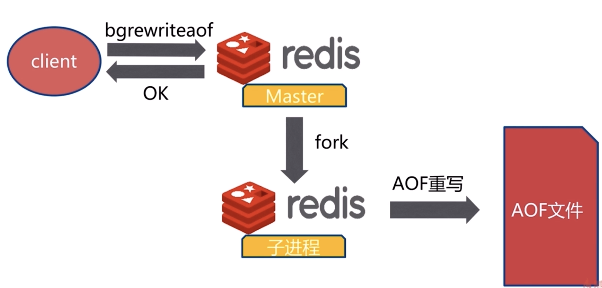

## Redis初识

### Redis是什么？

**特点**

- 开源
- 多种数据结构
- 基于键值对的存储服务系统
- 多种数据结构
- 高性能、功能丰富

**哪些公司在使用Redis**

- GitHub
- Twitter
- stackoverflow
- alibaba
- baidu
- weibo
- bilibili
...

**特性**

- 速度快
- 持久化
- 多种数据结构
- 支持多种编辑语言
- 功能丰富
- 简单
- 主从复制
- 高可用、分布式

**Redis特性-速度快**

- 存储在内存中
  
  
- 使用C语言开发的
- 线程模型：单线程

**Redis特性-持久化（断电不丢数据）**

- Redis所有数据保持在内存中，对数据的更新将异步地保存在磁盘上。

**Redis特性-多种数据结构**

主要5种数据结构：

- 字符串
- Hash
- 链表
- 集合
- 有序集合

还有数据结构

- BitMaps：位图
- HyperLogLog：超小内存唯一值计数
- GEO：地图信息定位

**Redis特性-支持多种客户端语言**

- java
- php
- python
- ruby
- go
- lua
- node
...

**Redis特性-功能丰富**

- 发布订阅
- Lua脚本
- 事务
- pipeline

**Redis特性-“简单”**

- 不依赖外部库（like libevent）
- 单线程模型

**Redis-主从复制**

  

**Redis-高可用、分布式**

- 高可用（redis-sentinel v2.8版本）
- 分布式（redis-Cluster v3.0版本）

**Redis典型应用功能**

- 缓存系统
- 计数器
- 消息队列系统
- 排行榜
- 社交网络
- 实时系统

### Redis安装


**Redis可执行文件说明**

- redis-server -》Redis服务器
- redis-cli -》Redis命令行客户端
- redis-benchmark -》Redis性能测试工具
- redis-check-aof -》AOF文件修复工具
- redis-check-dump -》 ROB文件检测工具
- redis-sentinel -》 Sentinel 服务器（2.8以后）

**Redis启动**

三种启动方式

- 最简启动
  - redis-server
- 动态参数启动
  - redis-server --port 6380
- 配置文件启动
  - redis-server configPath

区别：

- 生产环境选择配置启动
- 单机多实例配置文件可以用端口区别分开


**Redis客户端连接**

```shell
redis-cli -h ipaddress -p 6379
```

**Redis客户端返回值**

- 状态回复
- 错误回复
- 整数回复
- 字符串回复
- 多行字符串回复

**Redis常用配置**

- `daemonize`：是否是守护进程（no｜yes）（推荐yes）
- `port`：Redis对外端口号
- `logfile`：Redis系统日志
- `dir`：Redis工作目录；日志文件、持久化文件旧存储在这个目录中

> redis的默认端口是：`6379`

## Redis API的使用和理解

### 通用命令

- keys
- dbsize
- exists key
- del key [key ...]
- expire key seconds
- type key

**keys**

- `keys *`：遍历所有key
- `keys [pattern]`：可以加通配符
  - keys ke*
  - keys he[h-l]
  - keys ph?

> keys 命令一般不在生产环境中使用o(n)
> 那keys*怎么用呢？
> - 热备从节点
> - scan

**dbsize**

- `dbsize` 算出key的总数o(1)
- redis将这个指令做了优化
- 可以经常使用

**exists**

- `exists key` 检查key是否存在
- 0 是不存在；1 是存在

**del**

- `del key` 删除指令key-value
- 可以删除多个

**expire、ttl、persist**

- `expire key seconds` 过期时间 - 设置key在seconds秒后过期
- `ttl key` 查看key剩余的过期时间
- `persist key` 去掉key的过期时间

**type**

- `type key` 返回key的类型，会有以下返回的类型
- string
- hash
- list
- set
- zset
- none

**时间复杂度**

| 命令 | 时间复杂度 |
| -- | -- |
| keys | O(n) |
| dbsize | O(1) |
| del | O(1) |
| exists | O(1) |
| expire | O(1) |
| type | O(1) |

### 单线程

一个瞬间只会执行1条命令

**单线程为什么怎么快**

1. 纯内存
2. 非阻塞IO
3. 避免线程切换和竟态消耗

> 注意：
> 1. 一次只允许一条命令
> 2. 拒绝长（慢）命令
> 3. 其实不是完全的单线程；fysnc file descriptor；close file descriptor

### 字符串类型

按照 key - value 进行存储

注意：value最大上限是512MB

**内部编码**

- raw
- int
- embstr

**场景**

- 缓存
- 分布式锁
- 计数器
- 等等

**API**

- `incr key`：自增1
- `decr key`：自减1
- `incrby key k`：自增k
- `decrby key k`：自减k
- `set key value`：不管key是否存在，都设置
- `setnx key value`：key不存在，才设置
- `set key value XX`：key存在，才设置
- `mget key1 key2 key3...`：批量获取key，原子操作 O(n)
- `mset key1 value1 key2 value2 key3 value3...`：批量设置key-value O(n)
- `getset key newvalue`：set key newvalue并返回旧的value
- `append key value`：将value追加到旧的value
- `strlen key`：返回字符串的长度（注意中文）
- `incrbyfloat key 3.5`：增加key对应的值3.5
- `getrange key end`：获取字符串指定下标所有的值
- `setrange key index value`：设置指定下标所有对应的值

### 哈希类型

所以hash命令都是以h开头

- `hget key field`：获取value值
- `hset key field value`：设置value值
- `hdel key field`：删除value值
- `hexists key`
- `hlen key`
- `hgetall key`
- `hvals key`
- `hkeys key` 
- `hsetnx key`
- `hincrby key`
- `hincrbyfloat key`

**内部编码**

- hashtable
- ziplist

### 列表类型

- 结构：key-elments

**特点**

- 有序
- 可以重复

**API**

- rpush：从列表右边插入
- lpush：从列表左边插入
- linsert：在list指定的值前｜后插入newValue
- lpop：从左边弹出1个元素
- rpop：从右边弹出1个元素
- lrem：根据count值，从列表中删除所有value相等的项
- ltrim：按照索引范围修剪列表
- lrange：获取列表指定索引范围所有item
- lindex：获取累表指定索引的值
- llen：获取列表长度
- lset：设置列表指定索引值为newvalue
- blpop：阻塞弹出
- brpop：阻塞弹出

**实战**

- TimeLine

  


**内部编码**

- linkedlist
- ziplist

### 集合类型

**特点**

- 无序
- 无重复
- 集合间操作

**API**

- `sadd key element`：向集合key添加element（如果element已经存在，会添加失败）
- `srem key element`：奖集合key中的element移除掉
- `scard key`：计算集合大小
- `sismember key it`：判断it是否在集合中
- `srandmember key count`：从集合中随机挑count个元素
- `smembers key`：从集合中所有元素
  - 无序
  - 小心使用
- `srandmember key`： srandmember不会破坏集合
- `spop key`：spop从集合弹出
- sdiff：差
- sinter：并
- sunior：交

**实战**

- 抽奖系统
- Like、点赞、踩
- 标签
- 互相关注

**内部编码**

- hashtable
- intset

  

### 有序集合类型

**特点**

- key - value（score-value）

**集合VS有序集合**

- 无重复元素 - 无重复元素
- 无序 - 有序
- element - element + score

**API**

- zadd
- zrem
- zscore：获取元素分数
- zincrby：增加或减少元素的分数
- zcard：返回元素的总个数
- rank：获取元素的排名
- zrange：返回指定缩影范围内的生序元素
- zrangebyscore：返回指定分数范围内的升序元素
- zcount：返回有序集合在指定分数范围内的个数
- zremrangebyrank：删除指定排名内的生序元素
- zrevrank：
- zrevrange：
- zrevrangebyscore
- zinterstore
- zunionstore

**实例**

- 排行榜
- 

**内部编码**

- skiplist
- ziplist

## 客户端SDK的优点

|  | 优点 | 缺点 |
| -- | -- | -- |
| 直连 | 简单方便；适用于少量长期连接场景 | 存在每次新建/关闭TCP开销；资源无法控制,存在连接泄露的可能;go-redis对象线程不安全 |
| 连接池 | go-redis预先生成，降低开销使用；连接池的形式保护和控制资源的使用 | 相对于直连，使用相对麻烦，尤其在资源的管理上需要很多参数来保证，一旦规划不合理也会出现问题 |

## Redis其他功能

### 慢查询

**生命周期**

  

1. 慢查询发送在第3个阶段
2. 客户端超时不一定慢查询，但慢查询是客户端超时的一个可能因素

**配置**

  

- `slowlog-max-len`：慢查询队列长度，效果有以下几点：
  1. 先进先出对垒
  2. 固定长度
  3. 保存在内存内
- `slowlog-log-slower-than`：当查询超过这个时间就加入到这个慢查询队列中
  1. 慢查询阈值（单位：微秒）
  2. `slowlong-log-slower-than=0`，记录所有命令
  3. `slowlong-log-slower-than<0`，不记录任何命令

**方法**

1. 默认值
   - `config get slowlog-max-len = 128`
   - `config get slowlog-log-slower-than = 10000`
2. 修改配置文件重启

**命令**

1. `slowlog get[n]`：获取慢查询队列
2. `slowlog len`：获取慢查询队列长度
3. `slowlog reset`：清空慢查询队列

**运维经验**

1. `slowlogl-max-len`：不要设置过小，通常设置1000左右
2. `slowlog-log-slower-than`：不要设置过大，默认10ms，通常设置1ms
3. 理解慢查询出现的生命周期
4. 定期持久化慢查询

### pipeline - 流水线

1次网络命令通信模型

  

批量网络命令通信模型

  

**什么是流水线**

  

| 命令 | N个命令操作 | 1次pipeline(n个命令) |
| -- | -- | -- |
| 时间 | n次网络 + n次命令 | 1次网络 + n次命令 |
| 数据量 | 1次命令 | n条命令 |

> **注意：**
> 1. redis的命令时间是微妙级别的
> 2. pipeline每次条数要控制（网络）


**客户端实现**

  

**与原生M操作**


  

非原子

**建议**

1. 注意每次pipeline携带数据量
2. pipeline每次只能作用在一个Redis节点上 

### 发布订阅

**角色**

- 发布者（publisher）
- 订阅者（subscriber）
- 频道（channel）

  

订阅者是可以订阅多个频道的

**API**

- publish（发布命令）：订阅者个数
- unsubscribe：
- subscribe
- 其他

**消息队列**

  

### Bitmap - 位图

**什么是位图**

位图就是二进制，一位一位的，redis中可以一位一位的设置

**API**

- setbit
- getbit
- bitcount
- bitop
- bitpos

**例子**

- 独立用户统计

### HyperLogLog

**什么是HyperLogLog**

1. 基于HyperLogLog算法：极小空间完成独立数量统计。
2. 本质是字符串

**三个命令**

1. pfadd：向hyperloglog添加元素
2. pfcount：计算hyperloglog的独立总数
3. pfmerge：合并多个hyperloglog

**使用经验**

1. 是否能容错错误？（错误率：0.81%）
2. 是否需要单条数据？

### GEO

**什么是GEO**

- 存储经纬度，技术两地距离，范围计算等

**API**

- geoadd：添加地理信息
- geopos：获取地理信息
- geodist：获取两个地理位置的距离
- georadius：获取指定位置范围内的信息集合

## Redis持久化 - 特性

### 什么是Redis持久化

redis所有数据保持在内存中，对数据的更新将异步地保存到磁盘上

内存 -》持久化到磁盘

**持久化方式**

- 快照
  - MySQL Dump
  - Redis RDB
- 写日志
  - MySQL Binlog
  - Hbase Hlog
  - Redis AOF

### RDB

**什么是RDB**

 

RDB也是复制的媒介

**如何触发RDB**

主要有三种方式：

- save（同步）：会造成阻塞
  - 文件策略：如存在老的RDB文件，新替换老的
  - 复杂度：O(N)
- bgsave（异步）：使用redis子进程，来创建，但是fork也会造成阻塞
  - 文件策略和复杂度和save一样
- 自动：自动来生产rdb，但是不能控制（效果不好）

> 最佳配置:
> - 不要使用save
> - `dbfilename dump-${prot}.rdb`
> - `dir /bigdiskpath`
> - `stop-writes-on-bgsave-error yes`
> - `rdbcompression yes`

除了上面三种方式，还有几种**不容忽略方式**

1. 全量复制
2. debug reload
3. shutdown

**RDB总结**

1. RDB是Redis内存到硬盘的快照，用于持久化
2. save通常会阻塞Redis
3. bgsave不会阻塞Redis，但是会fork新进程
4. save自动配置满足任一就会被执行。
5. 有些触发技术不容忽视

### AOF

**RDB有什么问题**

- 耗时、耗性能
- 不可控、丢失数据

  

| 时间戳 | save |
| -- | -- |
| T1 | 执行多个写命令 |
| T2 | 满足执行多个写命令 |
| T3 | 再次执行多个写命令 |
| T4 | 宕机 |

> 如何T4阶段出现，T3到T4之间到数据就会消失（没保存）

那出现上面这种情况怎么办呢？

AOF就是解决上面的情况诞生的

**AOF运行原理**

Redis执行写命令就会打一条日志，并把日志打到AOF文件中

**AOF的三种策略**

- always：都会执行fsync到硬盘中
  -   
- everysec：每秒把缓冲区fsync到硬盘上（默认值）
  -   
- no：表示操作系统决定，操作系统觉得什么时候刷就什么时候刷
  -   

优缺点：

| 命令 | always | everysec | no |
| -- | -- | -- | -- |
| 优点 | 不丢失数据 | 每秒一次fsync丢1秒数据 | 不用管 |
| 缺点 | IO开销较大，一般的sata盘只有几百TPS | 丢1秒数据 | 不可控 |

**AOF重写**

其实就是将Redis的重写重读进行优化

作用

- 减少硬盘占用量
- 加速恢复速度

两种实现方式

- bgrewriteaof
  -   
- AOF重写配置
  - `auto-aof-rewrite-min-size`：AOF文件重写需要的尺寸
  - `auto-aof-rewrite-percentage`：AOF文件增长率
  - `aof-current_size`：AOF当前尺寸（单位：字节）
  - `aof_base_size`：AOF上次启动和重写的尺寸（单位：字节）
- 自动触发机制
  - aof_cuurent_size > auto-aof-rwrite-min-size
  - aof_current_size - aof_base_size/aof_base_size > auto-aof-rewrite-percentage

  

**Redis持久化的取舍和选择**

| 命令 | RDB | AOF |
| -- | -- | -- |
| 启动优先级 | 低 | 高 |
| 体积 | 小 | 大 |
| 恢复速度 | 快 | 慢 |
| 数据安全性 | 丢数据 | 根据策略决定 |
| 轻重 | 重 | 轻 |

**RDB最佳策略**

- “关”
- 集中管理
- 主从，从开

**AOF最佳策略**

- “开”：缓存和存储
- AOF重写集中管理
- 使用everysec

**最佳策略**

- 小分片
- 缓存或者存储
- 监控（硬盘、内存、负载、网络）
- 足够的内存

## Redis常见持久化开发问题

### fork操作

1. 同步操作
2. 与内存量息息相关：内存越大，耗时越长（与机器类型有关）
3. info:latest_fork_usec

**改善fork**

1. 有限使用物理机或者高效支持fork操作的虚拟化技术
2. 控制Redis实例最大可用内存：maxmemory
3. 合理配置Linux内存分配策略：vm.overcommit_memory=1
4. 降低fork频率：例如放宽AOF重写自动触发时机，不必要的全量复制

### 子进程开销和优化

1. CUP：
   - 开销：RDB和AOF文件生成，属于CPU密集型
   - 优化：不做CPU绑定，不和CPU密集型部署
2. 内存
   - 开销：fork内存开销，copy-on-write
   - 优化：echo never > /sys/kernel/mm/transparent_hugepage/enabled
3. 硬盘
   - 开销：AOF和RDB文件写入，可以集合iostat，iotop分析

**硬盘优化**

1. 不要和高硬盘负载服务部署在一起：存储服务、消息队列等
2. no-appendfsync-on-rewrite = yes
3. 根据写入量决定磁盘类型：例如ssd
4. 单机多实例持久化文件目录可以考虑分盘


### AOF阻塞

  

保证AOF安全性的策略

**如何定位呢？**

- redis日志：Asynchronous AOF fsync is taking too long （disk is bysy？）.Writing the AOF buffer without waiting for fsync to complete,this may slow down Redis.
- info persistence

## 主从复制

**单机有什么问题？**

- 机器故障
- 容量瓶颈
- QPS瓶颈

**主从复制作用**

- 数据副本
- 扩展读性能

  

**一主多从**

  

1. 一个master可以有多个slave
2. 一个slave可以有多个master
3. 数据流向是单向的，master到slave

### 如何设置主从复制

- slaveof命令
- 配置

  

**取消复制**

`slaveof no one`

**配置**

- `slaveof ip port`
- `slave-reday-only yes`

| 方式 | 命令 | 配置 |
| -- | -- | -- |
| 优点 | 无需重启 | 统一配置 |
| 优化 | 不变于管理 | 需要重启 |

